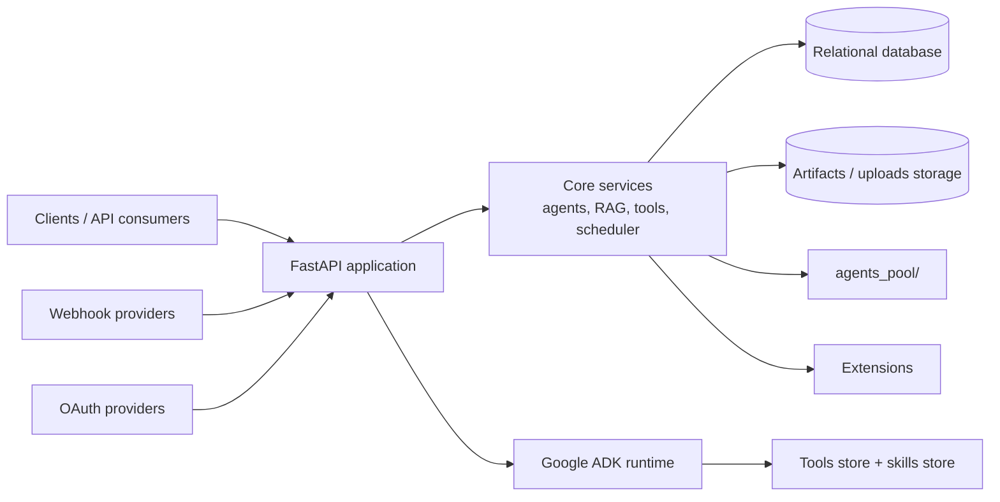

## Package layout

```
src/apowerb/
├── main.py              FastAPI entry point, middleware, startup
├── models.py            SQLAlchemy ORM models
│
├── auth/                Authentication and MFA
├── users/               User management
├── routers/             API endpoints
│   └── webhook_handlers/  Gmail and Outlook push handlers
├── integrations/        Third-party OAuth (Google, Microsoft, GitHub, Slack)
├── core/                Business logic — agents, ADK execution, hub, RAG streaming
│   └── extensions/      Extension loader and registry
├── tools_store/         Tool registry and the tool portfolio
├── skills_store/        Skills
├── agent_store/         Agent persistence
├── sqlgen/              Text-to-SQL generation
├── bi/                  Datasets, charts, dashboards
├── scheduler/           Mage client, webhook renewal, background runs
├── storage/             S3 abstraction
├── helpers/             Database, security, encryption, notification bus, migrations
├── schema/              Pydantic schemas
├── configs/             Settings, model pricing, logging
├── middleware/
└── cli/                 Typer commands
```

At runtime the server also creates `agents_pool/`, `artifacts_store/` and `uploads/`.

## Runtime architecture



This runtime view highlights the main execution path: incoming requests reach the FastAPI
entry point, the app bootstraps the internal services and ADK runtime, and persistence is
kept in the database plus the artifact storage layer.

## Startup sequence

<Steps>
  <Step title="Create runtime directories">
    `agents_pool/`, `artifacts_store/`, `uploads/`.
  </Step>
  <Step title="Run auto-migrations">
    `ensure_*` functions bring every table up to date. There is no separate migration
    command — the schema converges at boot.
  </Step>
  <Step title="Generate agent modules">
    Each agent stored in the database is materialised as a Python module under
    `agents_pool/`.
  </Step>
  <Step title="Start background tasks">
    Webhook renewal runs every six hours.
  </Step>
  <Step title="Mount the ADK sub-application">
    The Google ADK FastAPI application is mounted into the main app.
  </Step>
  <Step title="Load extensions">
    Modules named in `TH2_EXTENSIONS` register their routers, which are mounted after
    the core's. See [Editions](/concepts/editions).
  </Step>
</Steps>

<Warning>
  Migrations run at boot. Rolling the application back to a previous release does **not**
  roll the schema back — plan a database backup before upgrading a production instance.
</Warning>

## Database models

| Table | Description |
| --- | --- |
| `user` | Accounts — email, password, credits, OAuth identities, role |
| `integrations` | Connected OAuth services, with encrypted access and refresh tokens |
| `webhook_subscriptions` | Active watches — provider, subscription id, resource, agent, expiration |
| `webhook_logs` | Execution history — trigger event, agent response, duration, status |
| `notifications` | Per-user notifications, read state |
| `transactions` | Credit movements — purchase, usage, refund, bonus |

## Supported models

Model access goes through LiteLLM, so provider strings follow its convention:

- **Anthropic** — `anthropic/claude-sonnet-4-5-20250929`
- **OpenAI** — `openai/gpt-4o`
- **Mistral** — `mistral/mistral-large-latest`
- **Google** — `gemini/gemini-pro`
- **OVHcloud** — `ovhcloud/DeepSeek-R1-Distill-Llama-70B`
